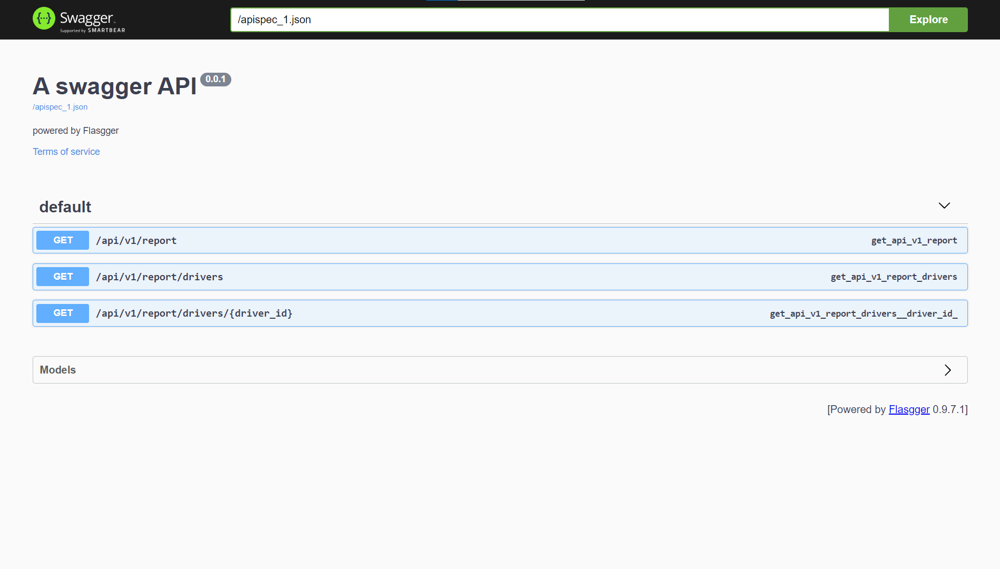

# F1 Racing Reports Web App

A web and api application using Flask to generate reports on Formula 1 racing results.

## Features

- **Driver Report:** View a list of Formula 1 drivers and their lap time statistics.
- **Ordering:** Sort the driver list in ascending or descending order.
- **Driver Details:** Get detailed lap time statistics for a specific driver.
- - **Format Selection:** Choose between JSON and XML formats when retrieving reports.

## Prerequisites

- Python 3.x
- Flask
- f1_racing_reports
- pytest

## Getting Started

1. Clone the repository:

    ```bash
    git clone https://github.com/AlexanderVVasilenko/web-monaco-report.git
    ```

2. Navigate to the project directory:

    ```bash
    cd web-monaco-report
    ```

3. Install dependencies:

    ```bash
    # If needed
    pip install -r requirements.txt
    ```

4. Run the Flask app:

    ```bash
    python src/app.py
    ```

5. Open your web browser and go to [http://127.0.0.1:5000/report/](http://127.0.0.1:5000/report/) to view the driver report.
   
6. Open your web browser and go to [http://127.0.0.1:5000/apidocs/](http://127.0.0.1:5000/apidocs/) to view the 
Swagger documentation.

## Endpoints

### 1. Get Full Racing Report

* **Endpoint: `/api/v1/report`**
* **Method: `GET`**
* **Parameters:**
  * **`order`** (optional): Specify the order of the report. Use **`asc`** for ascending order and **`desc`** for descending 
    order.
  * **`format`** (optional): Specify the response format. Use **`json`** or **`xml`**.
* **Response**:
  * Successful Response: 200 OK
  ```json lines
  {
    "racers": [
      {
        "name": "Driver Name",
        "team": "Driver Team",
        "lap_time": "0:01:30.000",
        "driver_id": "DR1"
      },
      // ... (additional racers)
    ]
  }
  ```
  * Error Response: 400 Bad Request
  ```json
  {
    "error": "Invalid order parameter"
  }
  ```
  * Error Response: 406 Not Acceptable response
  ```json
  {
    "error": "Invalid format parameter"
  }
  ```
### 2. Get Driver List
* **Endpoint: `/api/v1/report/drivers`**
* **Method: `GET`**
* **Parameters:**
  * **`order`** (optional): Specify the order of the report. Use **`asc`** for ascending order and **`desc`** for descending 
    order.
  * **`format`** (optional): Specify the response format. Use **`json`** or **`xml`**.
* **Response**:
  * Successful Response: 200 OK
  ```json lines
  {
    "racers": [
      {
        "driver_id": "DR1",
        "name": "Driver Name",
        "team": "Driver Team",
      },
      // ... (additional racers)
    ]
  }
  ```
  * Error Response: 400 Bad Request
  ```json
  {
    "error": "Invalid order parameter"
  }
  ```
  * Error Response: 406 Not Acceptable response
  ```json
  {
    "error": "Invalid format parameter"
  }
  ```
### 3. Get Driver Information
* **Endpoint: `/api/v1/report/drivers/<string:driver_id>`**
* **Method: `GET`**
* **Parameters:**
  * **`format`** (optional): Specify the response format. Use **`json`** or **`xml`**.
* **Response**:
  * Successful Response: 200 OK
  ```json
  {
    "racer": {
        "name": "Driver Name",
        "team": "Driver Team",
        "lap_time": "0:01:30.000",
        "driver_id": "DR1"
    }
  }
  ```
  * Error Response: 400 Bad Request
  ```json
  {
    "error": "Driver not found"
  }
  ```
  * Error Response: 406 Not Acceptable response
  ```json
  {
    "error": "Invalid format parameter"
  }
  ```
  
## Usage API

Explore the available endpoints, parameters, and responses interactively.



**Note:** Make sure the Flask app is running before accessing the Swagger documentation.

## Tests

Run the tests using:

```bash
python -m pytest tests/
